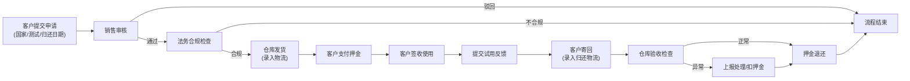

## 1. 产品概述

跨境样品借测系统是一套面向 B2B 业务场景的全流程样机管理平台，解决企业跨境出借测试样机时的申请、审批、物流追踪、押金管理、试用反馈及归还检查等全链路追踪问题。

- **核心价值**：通过角色化权限控制和流程化管理，实现样机从申请到归还的全生命周期可视化追踪，降低跨国借测的合规风险和管理成本
- **目标用户**：客户（申请方）、销售人员、仓库管理人员、法务合规人员

---

## 2. 核心功能

### 2.1 用户角色

| 角色 | 注册方式 | 核心权限 |
|------|----------|----------|
| 客户 | 企业邮箱注册 | 提交样机申请、查看申请状态、支付押金、填写试用反馈、查看物流 |
| 销售 | 内部账号开通 | 审核样机申请、查看全量申请单、跟进客户进度、处理押金退还 |
| 仓库 | 内部账号开通 | 处理发货录入、处理归还检查、录入物流信息、管理库存 |
| 法务 | 内部账号开通 | 查看合同信息、审核合规内容、检查出口国家合规性 |

### 2.2 功能模块

1. **登录认证模块**：用户登录、角色识别、权限控制
2. **样机申请模块**：客户填写申请单（目标国家、测试用途、预计归还日期）
3. **审批流程模块**：销售审核、法务合规审核
4. **库存管理模块**：样机信息维护、库存查询
5. **物流追踪模块**：发货物流、归还物流、状态更新
6. **押金管理模块**：押金收取、押金退还、状态追踪
7. **试用反馈模块**：客户填写测试报告、上传测试数据
8. **归还检查模块**：仓库验收、状态评估、异常处理
9. **合同管理模块**：合同生成、合同查看、合规检查

### 2.3 页面详情

| 页面名称 | 模块名称 | 功能描述 |
|----------|----------|----------|
| 登录页 | 认证模块 | 账号密码登录、角色自动识别跳转 |
| 客户仪表盘 | 客户首页 | 我的申请列表、待办事项、申请进度概览 |
| 新建申请页 | 申请模块 | 选择样机、填写国家/测试用途/归还日期、提交申请 |
| 申请详情页 | 申请模块 | 查看申请状态、时间线、物流信息、押金状态 |
| 销售仪表盘 | 销售首页 | 待审核列表、全部申请、统计数据 |
| 审核页 | 审批模块 | 审核申请、填写审核意见、一键通过/驳回 |
| 仓库仪表盘 | 仓库首页 | 待发货列表、待收货列表、库存概览 |
| 发货操作页 | 物流模块 | 录入快递单号、确认发货、上传出库凭证 |
| 归还检查页 | 归还模块 | 检查样机状态、录入归还报告、标记异常 |
| 法务仪表盘 | 法务首页 | 待合规审核、合同列表、合规检查记录 |
| 合同详情页 | 合同模块 | 查看合同内容、下载合同、标记合规状态 |
| 样机管理页 | 库存模块 | 样机信息录入、库存查询、状态管理 |

---

## 3. 核心流程

### 3.1 主业务流程

客户提交样机申请 → 销售审核申请 → 法务合规审核（如需）→ 仓库安排发货 → 客户支付押金 → 客户签收样机 → 客户测试使用并提交反馈 → 客户寄回样机 → 仓库验收检查 → 押金退还 → 流程结束

### 3.2 Mermaid 流程图

### 3.3 状态流转

申请单状态：草稿 → 待销售审核 → 待合规审核 → 待发货 → 已发货 → 测试中 → 待归还 → 归还中 → 已验收 → 已完成 / 已取消 / 已驳回

---

## 4. 用户界面设计

### 4.1 设计风格

- **主色调**：深海蓝 `#0F2B5B`（专业、可信赖），辅以科技青 `#00C2FF`（现代、高效）
- **辅助色**：成功绿 `#10B981`、警告橙 `#F59E0B`、危险红 `#EF4444`
- **背景**：浅灰渐变 `#F8FAFC` → `#F1F5F9`，卡片纯白 `#FFFFFF` 配细腻阴影
- **按钮风格**：圆角 8px，悬停微上浮效果，主按钮实色填充，次要按钮描边
- **字体**：标题使用 Inter SemiBold，正文使用 Inter Regular，数字使用 JetBrains Mono
- **布局风格**：左侧固定导航 + 右侧内容区，卡片式信息聚合，时间线展示流程进度
- **图标风格**：线性图标（Lucide），状态节点使用带色圆形图标

### 4.2 页面设计概览

| 页面名称 | 模块名称 | UI 元素 |
|----------|----------|----------|
| 客户仪表盘 | 首页 | 顶部统计卡片（进行中/待处理/已完成）、申请列表（带状态标签）、快捷入口、时间线概览 |
| 新建申请页 | 申请 | 表单向导（3步：选择样机 → 填写信息 → 确认提交）、国家选择器带国旗、日期选择器、实时表单验证 |
| 申请详情页 | 详情 | 顶部状态横幅、垂直时间线（展示各节点）、信息分组卡片、操作按钮区、附件列表 |
| 审核页 | 审批 | 申请信息总览、样机信息卡、合规风险提示、审核意见输入框、通过/驳回双按钮 |
| 仓库仪表盘 | 仓库 | 待发货/待收货双列看板、快速搜索、库存概览条形图、批量操作入口 |
| 法务仪表盘 | 法务 | 合同列表带合规标签、待审核高亮、国家风险评级标识、合同预览浮层 |

### 4.3 响应式设计

- **桌面优先**：主内容区 1200px 最大宽度，侧边栏 260px 固定
- **平板适配**：侧边栏可折叠，内容区自适应
- **触控优化**：按钮最小 44px 触控区域，关键操作二次确认

### 4.4 交互动效

- 页面加载：骨架屏 + 内容淡入
- 状态变更：时间线节点点亮动画
- 按钮悬停：轻微上浮 + 阴影加深
- 表单错误：震动反馈 + 红色提示
- 流程推进：进度条平滑过渡

---

## 5. 权限矩阵

| 功能 | 客户 | 销售 | 仓库 | 法务 |
|------|------|------|------|------|
| 提交申请 | ✅ | ❌ | ❌ | ❌ |
| 查看自己申请 | ✅ | ❌ | ❌ | ❌ |
| 查看全部申请 | ❌ | ✅ | ✅ | 仅合同相关 |
| 销售审核 | ❌ | ✅ | ❌ | ❌ |
| 合规审核 | ❌ | ❌ | ❌ | ✅ |
| 发货操作 | ❌ | ❌ | ✅ | ❌ |
| 归还检查 | ❌ | ❌ | ✅ | ❌ |
| 押金管理 | 仅支付 | 仅审批退还 | ❌ | ❌ |
| 合同查看 | 仅自己的 | 全部 | ❌ | 全部 |
| 样机管理 | ❌ | ✅ | ✅ | ❌ |
