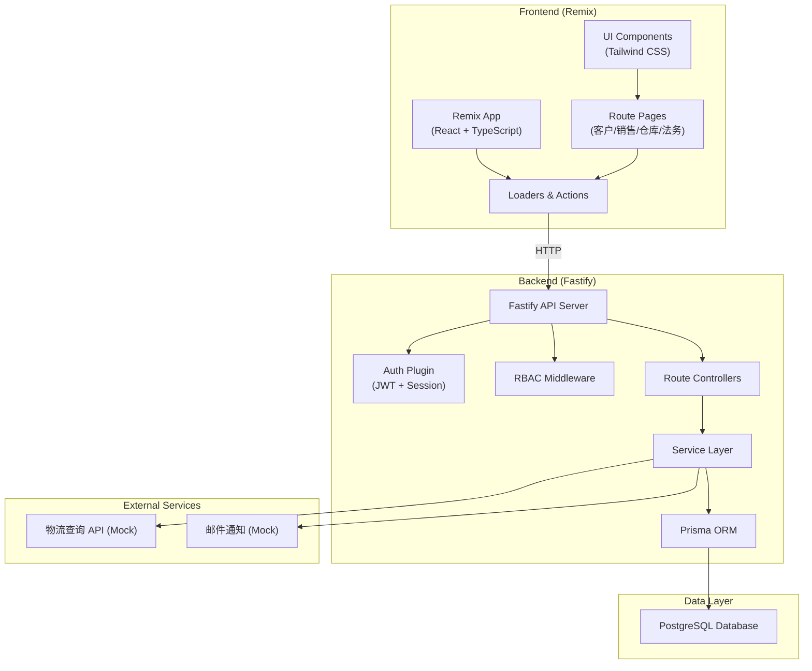
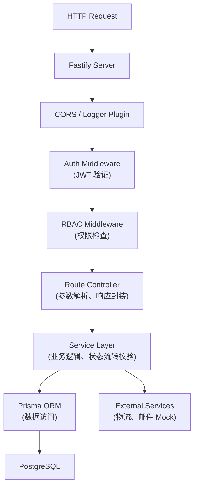
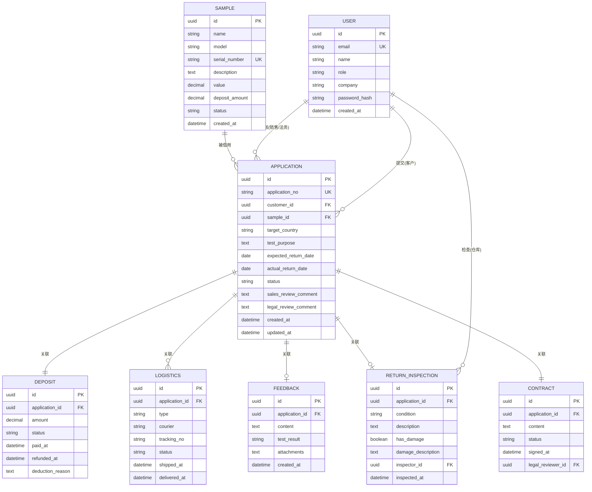

## 1. 架构设计

### 1.1 系统分层架构



---

## 2. 技术栈说明

### 2.1 前端 (Frontend)
- **框架**: Remix v2 (React 18 + TypeScript)
- **初始化**: `npx create-remix@latest`
- **样式**: Tailwind CSS v3
- **UI 组件**: Radix UI (Headless 组件) + Lucide React (图标)
- **状态管理**: Remix Loaders/Actions (内置) + React Context
- **表单处理**: Remix Form + Zod (验证)
- **HTTP 客户端**: Remix fetch (内置)

### 2.2 后端 (Backend)
- **框架**: Fastify v4 (TypeScript)
- **初始化**: `npm init fastify`
- **认证**: @fastify/jwt + @fastify/cookie
- **权限**: 自定义 RBAC 中间件
- **ORM**: Prisma v5
- **验证**: Zod
- **CORS**: @fastify/cors

### 2.3 数据库
- **数据库**: PostgreSQL 15+
- **连接**: Prisma ORM
- **迁移**: Prisma Migrate
- **种子数据**: Prisma Seed

### 2.4 开发工具
- **包管理器**: npm
- **构建工具**: TypeScript + tsup (后端) + Remix (前端)
- **代码规范**: ESLint + Prettier
- **测试**: Vitest + Supertest (后端)

### 2.5 目录结构
```
/
├── frontend/              # Remix 前端应用
│   ├── app/
│   │   ├── routes/        # 页面路由
│   │   ├── components/    # 可复用组件
│   │   ├── lib/           # 工具函数、API 客户端
│   │   └── styles/        # 全局样式
│   └── package.json
├── backend/               # Fastify 后端应用
│   ├── src/
│   │   ├── routes/        # API 路由
│   │   ├── services/      # 业务逻辑层
│   │   ├── middleware/    # 中间件
│   │   ├── plugins/       # Fastify 插件
│   │   └── utils/         # 工具函数
│   ├── prisma/
│   │   ├── schema.prisma  # 数据模型
│   │   └── seed.ts        # 种子数据
│   └── package.json
└── docker-compose.yml     # 本地开发环境
```

---

## 3. 前端路由定义

| 路由路径 | 页面名称 | 权限角色 | 说明 |
|----------|----------|----------|------|
| `/login` | 登录页 | 公开 | 用户登录入口 |
| `/` | 仪表盘 | 已登录 | 根据角色自动跳转对应首页 |
| `/customer/dashboard` | 客户仪表盘 | 客户 | 我的申请列表、统计 |
| `/customer/applications/new` | 新建申请 | 客户 | 提交样机申请 |
| `/customer/applications/:id` | 申请详情 | 客户 | 查看申请状态、时间线 |
| `/customer/applications/:id/feedback` | 提交反馈 | 客户 | 填写试用反馈 |
| `/sales/dashboard` | 销售仪表盘 | 销售 | 待审核列表、统计 |
| `/sales/applications/:id/review` | 审核申请 | 销售 | 审核通过/驳回 |
| `/sales/samples` | 样机管理 | 销售 | 样机信息维护 |
| `/warehouse/dashboard` | 仓库仪表盘 | 仓库 | 待发货、待收货列表 |
| `/warehouse/applications/:id/ship` | 发货操作 | 仓库 | 录入物流信息 |
| `/warehouse/applications/:id/return` | 归还检查 | 仓库 | 验收检查 |
| `/legal/dashboard` | 法务仪表盘 | 法务 | 待合规审核、合同列表 |
| `/legal/applications/:id/contract` | 合同详情 | 法务 | 查看、审核合同 |
| `/legal/applications/:id/compliance` | 合规审核 | 法务 | 合规检查 |

---

## 4. 后端 API 定义

### 4.1 TypeScript 类型定义

```typescript
// 用户角色
type UserRole = 'customer' | 'sales' | 'warehouse' | 'legal';

// 申请状态
type ApplicationStatus = 
  | 'draft'
  | 'pending_sales_review'
  | 'pending_legal_review'
  | 'sales_rejected'
  | 'legal_rejected'
  | 'approved'
  | 'pending_shipment'
  | 'shipped'
  | 'in_testing'
  | 'pending_return'
  | 'returning'
  | 'inspecting'
  | 'completed'
  | 'cancelled';

// 用户
interface User {
  id: string;
  email: string;
  name: string;
  role: UserRole;
  company?: string;
  phone?: string;
  createdAt: Date;
}

// 样机
interface Sample {
  id: string;
  name: string;
  model: string;
  serialNumber: string;
  description: string;
  value: number;
  depositAmount: number;
  status: 'available' | 'borrowed' | 'maintenance';
  createdAt: Date;
}

// 申请单
interface Application {
  id: string;
  applicationNo: string;
  customerId: string;
  sampleId: string;
  targetCountry: string;
  testPurpose: string;
  expectedReturnDate: Date;
  actualReturnDate?: Date;
  status: ApplicationStatus;
  salesReviewComment?: string;
  legalReviewComment?: string;
  createdAt: Date;
  updatedAt: Date;
}

// 物流记录
interface Logistics {
  id: string;
  applicationId: string;
  type: 'outbound' | 'return';
  courier: string;
  trackingNo: string;
  status: 'created' | 'shipped' | 'in_transit' | 'delivered';
  shippedAt?: Date;
  deliveredAt?: Date;
}

// 押金记录
interface Deposit {
  id: string;
  applicationId: string;
  amount: number;
  status: 'pending' | 'paid' | 'refunding' | 'refunded' | 'deducted';
  paidAt?: Date;
  refundedAt?: Date;
  deductionReason?: string;
}

// 试用反馈
interface Feedback {
  id: string;
  applicationId: string;
  content: string;
  testResult: 'pass' | 'fail' | 'partial';
  attachments?: string[];
  createdAt: Date;
}

// 归还检查
interface ReturnInspection {
  id: string;
  applicationId: string;
  condition: 'good' | 'damaged' | 'missing_parts';
  description: string;
  hasDamage: boolean;
  damageDescription?: string;
  inspectorId: string;
  inspectedAt: Date;
}

// 合同
interface Contract {
  id: string;
  applicationId: string;
  content: string;
  status: 'pending' | 'approved' | 'rejected';
  signedAt?: Date;
  legalReviewerId?: string;
}
```

### 4.2 API 接口列表

| 方法 | 路径 | 模块 | 说明 | 权限 |
|------|------|------|------|------|
| POST | `/api/auth/login` | 认证 | 用户登录 | 公开 |
| POST | `/api/auth/logout` | 认证 | 用户登出 | 已登录 |
| GET | `/api/auth/me` | 认证 | 获取当前用户 | 已登录 |
| GET | `/api/applications` | 申请 | 获取申请列表 | 客户(仅自己)/销售/仓库/法务 |
| GET | `/api/applications/:id` | 申请 | 获取申请详情 | 同上 |
| POST | `/api/applications` | 申请 | 创建申请 | 客户 |
| PUT | `/api/applications/:id` | 申请 | 更新申请 | 客户(草稿状态) |
| POST | `/api/applications/:id/submit` | 申请 | 提交审核 | 客户 |
| POST | `/api/applications/:id/sales-review` | 审批 | 销售审核 | 销售 |
| POST | `/api/applications/:id/legal-review` | 审批 | 法务审核 | 法务 |
| POST | `/api/applications/:id/ship` | 物流 | 发货 | 仓库 |
| POST | `/api/applications/:id/confirm-delivery` | 物流 | 确认收货 | 客户 |
| POST | `/api/applications/:id/initiate-return` | 物流 | 发起归还 | 客户 |
| POST | `/api/applications/:id/confirm-return-ship` | 物流 | 确认归还发货 | 客户 |
| POST | `/api/applications/:id/inspect-return` | 归还 | 验收检查 | 仓库 |
| POST | `/api/applications/:id/feedback` | 反馈 | 提交试用反馈 | 客户 |
| POST | `/api/deposits/:id/pay` | 押金 | 支付押金 | 客户 |
| POST | `/api/deposits/:id/refund` | 押金 | 退还押金 | 销售 |
| GET | `/api/samples` | 样机 | 获取样机列表 | 销售/仓库 |
| POST | `/api/samples` | 样机 | 创建样机 | 销售 |
| GET | `/api/samples/:id` | 样机 | 获取样机详情 | 销售/仓库 |
| GET | `/api/contracts/:id` | 合同 | 获取合同详情 | 客户(仅自己)/销售/法务 |
| POST | `/api/contracts/:id/approve` | 合同 | 审核合同 | 法务 |
| GET | `/api/logistics/:id/track` | 物流 | 物流追踪 | 相关人员 |

---

## 5. 后端架构分层



### 5.1 分层说明
- **Middleware 层**: 认证、权限、请求日志、错误处理
- **Controller 层**: 路由定义、参数校验、请求响应处理
- **Service 层**: 核心业务逻辑、状态机校验、事务控制
- **Repository 层**: Prisma ORM 封装、数据库操作

---

## 6. 数据模型设计

### 6.1 ER 图



### 6.2 DDL 语句 (Prisma Schema)

```prisma
generator client {
  provider = "prisma-client-js"
}

datasource db {
  provider = "postgresql"
  url      = env("DATABASE_URL")
}

enum UserRole {
  customer
  sales
  warehouse
  legal
}

enum ApplicationStatus {
  draft
  pending_sales_review
  pending_legal_review
  sales_rejected
  legal_rejected
  approved
  pending_shipment
  shipped
  in_testing
  pending_return
  returning
  inspecting
  completed
  cancelled
}

enum LogisticsType {
  outbound
  return
}

enum LogisticsStatus {
  created
  shipped
  in_transit
  delivered
}

enum DepositStatus {
  pending
  paid
  refunding
  refunded
  deducted
}

enum TestResult {
  pass
  fail
  partial
}

enum SampleCondition {
  good
  damaged
  missing_parts
}

enum ContractStatus {
  pending
  approved
  rejected
}

model User {
  id            String        @id @default(uuid())
  email         String        @unique
  name          String
  role          UserRole
  company       String?
  phone         String?
  passwordHash  String
  createdAt     DateTime      @default(now())
  applications  Application[] @relation("CustomerApplications")
  salesReviews  Application[] @relation("SalesReviews")
  legalReviews  Application[] @relation("LegalReviews")
  inspections   ReturnInspection[]
}

model Sample {
  id           String        @id @default(uuid())
  name         String
  model        String
  serialNumber String        @unique
  description  String?
  value        Decimal       @db.Decimal(12, 2)
  depositAmount Decimal      @db.Decimal(12, 2)
  status       String        @default("available")
  createdAt    DateTime      @default(now())
  applications Application[]
}

model Application {
  id                String              @id @default(uuid())
  applicationNo     String              @unique
  customerId        String
  sampleId          String
  targetCountry     String
  testPurpose       String              @db.Text
  expectedReturnDate DateTime           @db.Date
  actualReturnDate  DateTime?           @db.Date
  status            ApplicationStatus   @default(draft)
  salesReviewComment String?            @db.Text
  legalReviewComment String?            @db.Text
  salesReviewerId   String?
  legalReviewerId   String?
  createdAt         DateTime            @default(now())
  updatedAt         DateTime            @updatedAt
  customer          User                @relation("CustomerApplications", fields: [customerId], references: [id])
  sample            Sample              @relation(fields: [sampleId], references: [id])
  salesReviewer     User?               @relation("SalesReviews", fields: [salesReviewerId], references: [id])
  legalReviewer     User?               @relation("LegalReviews", fields: [legalReviewerId], references: [id])
  deposit           Deposit?
  logistics         Logistics[]
  feedback          Feedback?
  returnInspection  ReturnInspection?
  contract          Contract?
}

model Deposit {
  id               String         @id @default(uuid())
  applicationId    String         @unique
  amount           Decimal        @db.Decimal(12, 2)
  status           DepositStatus  @default(pending)
  paidAt           DateTime?
  refundedAt       DateTime?
  deductionReason  String?        @db.Text
  application      Application    @relation(fields: [applicationId], references: [id])
}

model Logistics {
  id             String          @id @default(uuid())
  applicationId  String
  type           LogisticsType
  courier        String
  trackingNo     String
  status         LogisticsStatus @default(created)
  shippedAt      DateTime?
  deliveredAt    DateTime?
  createdAt      DateTime        @default(now())
  application    Application     @relation(fields: [applicationId], references: [id])
}

model Feedback {
  id             String     @id @default(uuid())
  applicationId  String     @unique
  content        String     @db.Text
  testResult     TestResult
  attachments    String?    @db.Text
  createdAt      DateTime   @default(now())
  application    Application @relation(fields: [applicationId], references: [id])
}

model ReturnInspection {
  id                 String          @id @default(uuid())
  applicationId      String          @unique
  condition          SampleCondition
  description        String          @db.Text
  hasDamage          Boolean         @default(false)
  damageDescription  String?         @db.Text
  inspectorId        String
  inspectedAt        DateTime        @default(now())
  application        Application     @relation(fields: [applicationId], references: [id])
  inspector          User            @relation(fields: [inspectorId], references: [id])
}

model Contract {
  id               String         @id @default(uuid())
  applicationId    String         @unique
  content          String         @db.Text
  status           ContractStatus @default(pending)
  signedAt         DateTime?
  legalReviewerId  String?
  application      Application    @relation(fields: [applicationId], references: [id])
  legalReviewer    User?          @relation(fields: [legalReviewerId], references: [id])
}
```

### 6.3 索引设计
```sql
-- 申请单索引
CREATE INDEX idx_application_customer_id ON application(customer_id);
CREATE INDEX idx_application_status ON application(status);
CREATE INDEX idx_application_created_at ON application(created_at DESC);

-- 物流索引
CREATE INDEX idx_logistics_application_id ON logistics(application_id);
CREATE INDEX idx_logistics_tracking_no ON logistics(tracking_no);

-- 用户角色索引
CREATE INDEX idx_user_role ON user(role);
```

### 6.4 种子数据 (Seed)

```typescript
// 创建测试用户
const users = await prisma.user.createMany({
  data: [
    { email: 'customer@example.com', name: '测试客户', role: 'customer', company: 'ABC公司', passwordHash: '...' },
    { email: 'sales@example.com', name: '张销售', role: 'sales', passwordHash: '...' },
    { email: 'warehouse@example.com', name: '李仓管', role: 'warehouse', passwordHash: '...' },
    { email: 'legal@example.com', name: '王法务', role: 'legal', passwordHash: '...' },
  ]
});

// 创建测试样机
const samples = await prisma.sample.createMany({
  data: [
    { name: '智能路由器 Pro', model: 'RT-Pro-2024', serialNumber: 'SN001', value: 5000, depositAmount: 5000 },
    { name: 'IoT 开发板', model: 'IOT-DEV-V2', serialNumber: 'SN002', value: 3200, depositAmount: 3200 },
    { name: '5G 测试模组', model: '5G-MOD-X1', serialNumber: 'SN003', value: 12000, depositAmount: 12000 },
  ]
});
```
